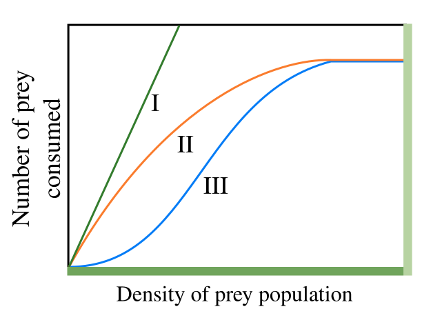
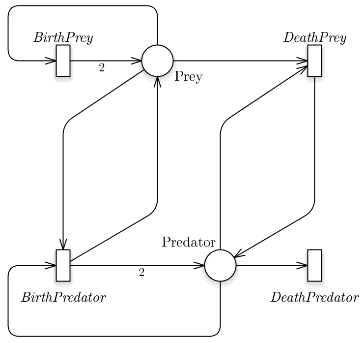
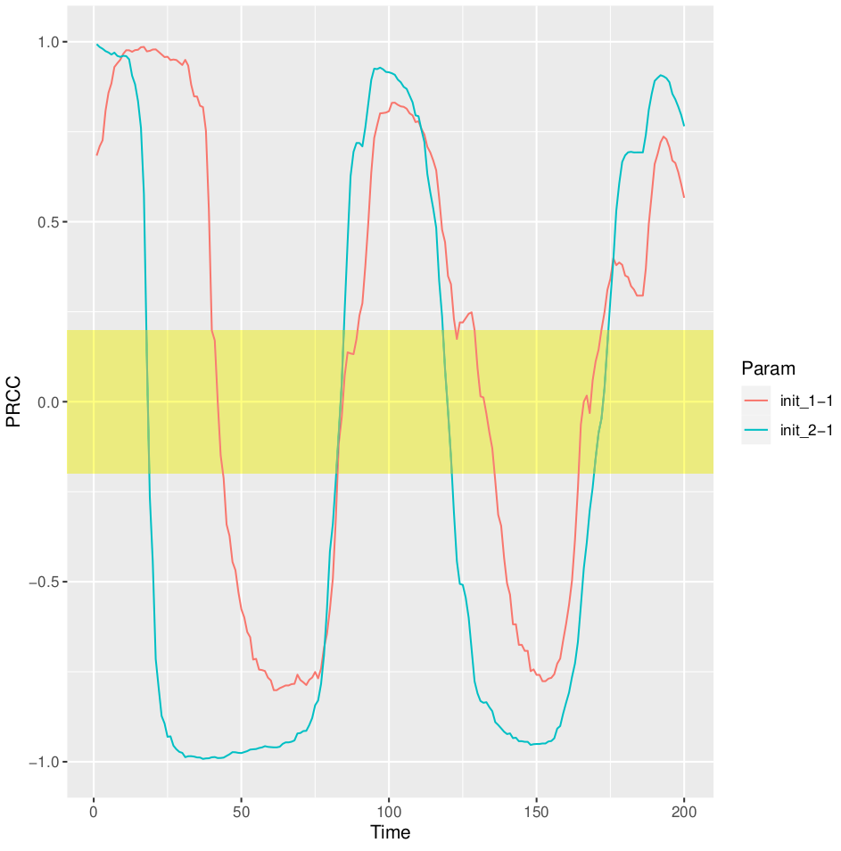
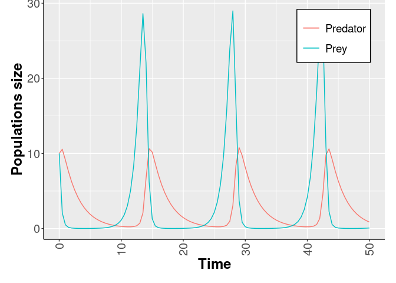
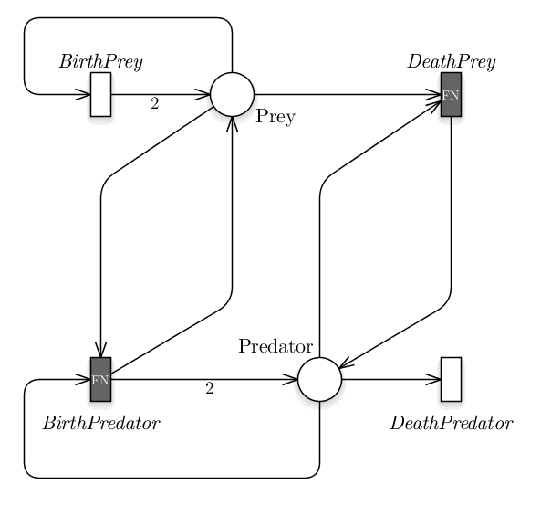

```{r, include = FALSE}
knitr::opts_chunk$set(
  collapse = TRUE,
  comment = "#>"
 
)
```


In this page we show how the \gls{ESPN} and \gls{ESSN} formalisms can be efficiently used to analyse the Lotka-Volterra model, also known as the *predator-prey model* \cite{lotka1998analytical}.

## The Lotka–Volterra model


The Lotka-Volterra model is defined by a pair of \gls{ODE}s, which describes the dynamics of biological systems characterized by two species that may interact, one as a predator and the other as prey. From the literature it is possible to find several definitions of this model \cite{dale1994functional,cosner1999effects,rahman2013predator}, and in \cite{holling1959components} a first classification of these models is reported depending on the *functional response*, i.e., the change in the rate of prey consumption by a predator when the prey density varied. In details, the 
functional response can be classified in three major types, namely **Holling type I, II, III**, whose definitions can be summarize as follows.

1. *Holling type I*: the number of prey consumed shows a linear relationship with the prey density, the green line in Fig1. 
2. *Holling type II*: the gradient of the number of prey consumed decreases monotonically with increasing prey density, eventually saturating at a constant value of prey consumption, the orange line in Fig1. This follows from the assumption that the consumer is limited by its capacity to process food. A real example of this phenomena was published in \cite{dale1994functional} considering  wolves and caribou. It was shown that the proportion of caribou killed per wolf decreases as caribou density increases, given that wolves are more easily satiated and the total number of caribou kills reaches a plateau.  Mathematically, this model is equivalent to the model of enzime kinetics developed in 1913 by L. Michaelis and M. Menten \cite{michaelis2007kinetik}.
3. *Holling type III*: the gradient of the number of prey consumed first increases and then decreases with increasing prey density, the blue line in Fig.1. This sigmoidal behaviour has been attributed to the existence of ‘learning behaviour’ in the predator population, for example predators learning more specialised techniques for hunting or prey handling.




Independently by the functional response exploited, a general version of the prey-predator model is defined by the following \gls{ODE}s system.

\begin{align}\label{eq:HollinGeneral}
Eq.s 1 & \\
    \frac{dx_{Prey}}{d\nu} &= f(x_{Prey}) x_{Prey}- g(x_{Prey},x_{Predator}) x_{Predator},\\
    \frac{dx_{Predator}}{d\nu} &= \epsilon g(x_{Prey},x_{Predator})x_{Predator} -\gamma x_{Predator},  \nonumber 
\end{align}
where:

1. $x_{Prey}$ is the number of preys (e.g., caribou, rabbits, etc);
2. $x_{Predator}$ is the number of predators (e.g., wolves, foxes, etc);
3. $\nu$ represents time;
4. $f(x_{Prey})$ is the individual prey growth rate in the absence of
  predators;
5. $g(x_{Prey},x_{Predator})$ is the functional response of the model;
6. $\epsilon$ is the efficiency of the predator in converting consumed prey into predator offspring;
7. $\gamma$ is the predator mortality rate.

## First step: call the package 


```{r}
library(epimod)
``` 

Download all the docker images used by *epimod*:

```{r,eval=F}
downloadContainers()
``` 

## Second step: SPN Model generation

The simplest and more known prey-predator model \cite{lotka1998analytical} exploits a functional response of type I, in which a predator might interact with all the prey, thus the product of the two populations is the obvious outcome. This model can be easily represented using the SPN formalism, see Fig.2, from which the following ODEs system can be derived:

\begin{align}
Eq.s 2 & \\
    \frac{d\hat{x}_{Prey}}{d\nu} &= \alpha \hat{x}_{Prey}-\beta \hat{x}_{Prey}\hat{x}_{Predator},\\
    \frac{d\hat{x}_{Predator}}{d\nu} &= \delta \hat{x}_{Prey}\hat{x}_{Predator}-\gamma \hat{x}_{Predator},  \nonumber 
\end{align}

where:

1.  $x_{Prey}$ is the average number of tokens in the *Prey* place, representing the preys;
2.  $x_{Predator}$ is the average number of tokens in the *Predator* place, representing the predators;
3.  $\alpha,\ \beta,\ \gamma,\ \theta$ are positive real parameters
  describing the interaction of the two species and defining the rate of the *BirthPrey*, *DeathPrey*, *BirthPredator*, *DeathPrey* transitions, respectively.

Let use note that Eq.s 2 can be obtained from Eq.s 1 defining 
$g(x_{Prey},x_{Predator}) = \beta x_{Prey}$, $f(x_{Prey}) = \alpha$ , and $\delta = \beta \epsilon$.



In this model we are assuming that the prey have an unlimited food supply and it is able to reproduce exponentially (*BirthPrey* transition), unless subject to predation (*DeathPrey* transition). Differently, the food supply of the predator population depends entirely on the size of the prey population. Thus, the predator birth depends linearly on the number of prey at a specific time point (*BirthPredator* transition), while the predators death does not depend on it (*DeathPredator* transition). We can denote that all the transitions have a velocity rate defined according to  Mass Action (MA) law.

Therefore, starting from the the SPN model saved in the *./Net/Lotka-Volterra.PNPRO* we can generate the solver which will be used throughtout the analysis.

```{r, linewidth = 80,eval=FALSE}

model_generation(net_fname = "./Net/Lotka-Volterra.PNPRO")

``` 


###  Sensitivity analysis

The R function *sensitivity_analysis()* implements the sensitivity analysis taking as input 

1. the \emph{.solver} file generated by the *model_generation* function,
the total number of samplings to be performed,
2. the final solution time,
3. the time step defining the frequency at which explicit estimates for the system values are desired,
4. parameters_fname (*Functions_list.csv*): a textual file in which the  parameters to be studied are listed associated with their range of variability.
significato delle colonne, e che serve il ; come sep, spazi non nei path
An example is given by the following file, where
```{r, echo= FALSE}
read.csv("Input/Functions_list.csv", header=FALSE,sep=";")
```
5. functions_fname (*Functions.R*): an R file storing all the functions that have to be exploited to generate the associated paramter from *parameters_fname*. In this case we want to generate the SPN initial marking exploiting the uniform distribution:
```{r, linewidth = 80 }
init_generation<-function(min_init , max_init)
{
    # min/max are vectors = first position interval values for the first place
    # and second position for the second place.

   i_1=runif(n=1,min=min_init[1],max=max_init[1])
   i_2=runif(n=1,min=min_init[2],max=max_init[2])

   return( c(i_1,i_2) )
}
```
6. target_value_fname (*Target.R*): an R function in which the place, w.r.t. the PRCC has to be calculated, must be selected from the output data.frame (which represents the output file *.trace* reporting the dynamics of each place).

Assuming the following fixed rates:
$\beta = 4/3,\  \theta = 1.$
Than we change the prey and predator initial conditions from 200 to 1800, and the prey and predator birth rates $\alpha,\ \gamma$ from 0.1 to 2, knowing that we are interested to the trajectory generated with the following values: $x(0) = 1000,\ y(0)=500,\ \alpha = 2/3,\ \gamma = 1$.

#### PRCC and ranking

This step is necessary if we are interested to calculate the PRCC  to identify among the input  parameters  which are the sensitive ones (i.e., those that have a great effect on the model behaviour). 
This  may simplify the calibration step reducing (1) the number of variables to be estimated and (2) the search  space associated with each estimated parameter.

In order to run the simulations, the user must provide

1. the reference dataset;
2. the definition of a function to compute the distance (or error) between the models' output and the reference dataset itself.

In this case the reference dataset is the trajectory obtained from the starting point 1 predator and 1 prey. Similarly to the previouos step, we generate different initial conditions for the system but in this case. 


The function defining the distance takes in inputs only the reference data and the simulation's output (i.e. a trajectory); an example it could be the following:

```{r, linewidth = 80 }
msqd<-function(reference, output)
{
    Predator <- output[,"Predator"]
    Prey <- output[,"Prey"]

    diff.Predator <- sum(( Predator - reference[,2] )^2 )
    diff.Prey <- sum(( Prey - reference[,1] )^2 )

    return(diff.Predator+diff.Prey)
}
```

where the squared error between the Predator and Prey trajectories obtaained from the simulation and the corresponding reference trajectories are calculated, respectively named *diff.Predator* and *diff.Prey*. Then, the sum of these errors is returned. Our purpose will be to minimize (see next section) this function in order to identify the trajectory most similar to the reference data, therefore 

```{r, linewidth = 80 }
Target<-function(output)
{
    ret <- output[,"Predator"]
    return(as.data.frame(ret))
}
```

Let us note that the name of the distance and target function must have the same name of the corresponding R file.

```{r, linewidth = 80 , eval=FALSE}

sensitivity<-sensitivity_analysis(n_config = 30,
                                  parameters_fname = "Input/Functions_list.csv",
                                  functions_fname = "Rfunction/Functions.R",
                                  solver_fname = "Net/Lotka-Volterra.solver",
                                  reference_data = "Input/reference_data.csv",
                                  distance_measure_fname = "Rfunction/msqd.R" ,
                                  target_value_fname = "Rfunction/Target.R" ,
                                  parallel_processors = 2,
                                  f_time = 20,
                                  s_time = .1)
```


```{r, linewidth=80, echo=F, message=F }

##############################
## Let draw the orbits characterizing the phase-space
##############################

library(ggplot2)

load("./Results/results_sensitivity_analysis/Lotka-Volterra-sensitivity.RData")
load("./Results/results_sensitivity_analysis/ranking_Lotka-Volterra-sensitivity.RData")
reference <- as.data.frame(t(read.csv("Input/reference_data.csv",
                                      header = FALSE,
                                      sep = " ")))

# Then, we read all the trajectories generated saving them in a list called
# ListTraces. List that will be rewritten as a data frame in order to use ggplot.
# ConfigID represents the initial condition associated to each trajectory,
# which was generated by using the function implemented in the file Functions.R .

listFile<-list.files("./Results/results_sensitivity_analysis/",
                     pattern = ".trace")

configID<-t(sapply(1:length(listFile),
                   function(x){
                       return(c(x,config[[1]][[x]][[3]]))
                   }) )

id.traces<-as.numeric(gsub("[^[:digit:].]", "",listFile) )

ListTraces<-lapply(id.traces,
                   function(x){
                       trace.tmp=read.csv(paste0(
                           "./Results/results_sensitivity_analysis/Lotka-Volterra-sensitivity-",
                           x,
                           ".trace"), sep = "")
                       trace.tmp=data.frame(trace.tmp,ID=rank[which(rank[,2]==x),1])
                       return(trace.tmp)
                   })

traces <- do.call("rbind", ListTraces)

ggplot( )+
    geom_path(data=traces,
              aes(x=Prey,y=Predator,group=ID,col=ID),
              arrow=arrow(length=unit(0.3,"cm"),ends="first"))+
    geom_path(data=reference,
              aes(x=V1,y=V2),
              col="red",
              arrow=arrow(length=unit(0.3,"cm"),ends="first"))
```



Running the sensisitivity analysis, we can replicate the results reported on Wikipedia, *https://en.wikipedia.org/wiki/Lotka%E2%80%93Volterra_equations*. Indeed, textual file for each generated parameter combination (i.e. 20) containing the system  solution is returned. Each file is characterized by as many rows as the solution time points (obtained dividing the final time point by the time step) and as many columns as the system components.
We can now generate the phase-space plot, where it is possible to see that the predators thrive when there are plentiful prey but, ultimately, outstrip their food supply and decline. As the predator population is low, the prey population will increase again. These dynamics continue in a cycle of growth and decline.

Let us note that it is possible to run the sensitivity analysys without PRCC or ranking, in the case that we are intersted only on to have a general idea of the simulation' results.

### Calibration analysis

By exploiting the calibration function we want to calibrate our model in order to fit the dynamics w.r.t. the reference data, where the fittinf is defined by the distance implemented in *msqd.R*.

```{r, linewidth = 80, eval = FALSE }

model_calibration(solver_fname = "Net/Lotka-Volterra.solver",
                  reference_data = "Input/reference_data.csv",
                  distance_measure_fname = "Rfunction/msqd.R" ,
                  f_time = 20,
                  s_time = .1,
                  # Vectors to control the optimization
                  ini_v = c(5,5),
                  ub_v = c(10, 10),
                  lb_v = c(0, 0),
                  max.time = 60 # seconds
)

```

### Whatif Analysis

Finally, the periodic dynamics of the system can be obatined running the model analysis function as follows:

```{r, linewidth = 80, eval = FALSE }

model_analysis(solver_fname = "Net/Lotka-Volterra.solver",
                  parameters_fname = "Input/Paramters_list.csv",
                  f_time = 50,
                  s_time = .5
)

```

```{r,  echo= FALSE, eval = FALSE }

model_analysis(solver_fname = "Net/Lotka-Volterra.solver",
                  parameters_fname = "Input/Paramters_list.csv",
                  f_time = 50,
                  s_time = .5
)

Dynamics<-read.csv("results_model_analysis/Lotka-Volterra-analysys-1.trace",  sep = "")

ggplot(Dynamics, aes(x= Time))+
  geom_line(aes(y= Predator, color = "Predator"))+
  geom_line(aes(y= Prey, color = "Prey"))+ 
  theme(axis.text=element_text(size = 15, hjust = 0.5),
        axis.text.x=element_text(angle=+90,vjust=0.5, hjust=1),
        axis.title=element_text(size=18,face="bold"),
        axis.line = element_line(colour="black"),
        plot.title=element_text(size=20, face="bold", vjust=1, lineheight=0.6),
        legend.title = element_blank(),
        legend.text=element_text(size=14),
        legend.position= c(.85, .85),
        legend.background = element_rect(size=0.5, linetype="solid", 
                                         colour ="black"),
        legend.key=element_blank(),
        legend.key.size = unit(.9, "cm"),
        legend.key.width = unit(.9,"cm"),
        panel.background = element_rect(colour = NA),
        plot.background = element_rect(colour = NA),
        plot.margin=unit(c(0,5,5,5),"mm"),
        strip.background=element_rect(colour="#f0f0f0",fill="#f0f0f0"),
        strip.text = element_text(face="bold",size = 15))+
  labs(x="Time", y="Populations size" )


DynamicsFirstPart <- Dynamics[1:min(which(Dynamics$PreyConsumed>10)),]
ggplot(DynamicsFirstPart, aes(x= Prey))+
  geom_line(aes(y= 10 - PreyConsumed))+ 
  theme(axis.text=element_text(size = 15, hjust = 0.5),
        axis.text.x=element_text(angle=+90,vjust=0.5, hjust=1),
        axis.title=element_text(size=18,face="bold"),
        axis.line = element_line(colour="black"),
        plot.title=element_text(size=20, face="bold", vjust=1, lineheight=0.6),
        legend.title = element_blank(),
        legend.text=element_text(size=14),
        legend.position= c(.85, .85),
        legend.background = element_rect(size=0.5, linetype="solid", 
                                         colour ="black"),
        legend.key=element_blank(),
        legend.key.size = unit(.9, "cm"),
        legend.key.width = unit(.9,"cm"),
        panel.background = element_rect(colour = NA),
        plot.background = element_rect(colour = NA),
        plot.margin=unit(c(0,5,5,5),"mm"),
        strip.background=element_rect(colour="#f0f0f0",fill="#f0f0f0"),
        strip.text = element_text(face="bold",size = 15))+
  labs(x="Prey", y="Prey consumed" )
```

In Fig.5 the Lotka-Volterra dynamics are showed fixing: $\alpha = 1.1$, $\beta= 0.4$, $\gamma=0.1$, $\theta=0.4$, and the initial number of both the species equals to 10.




```{r, linewidth = 80, eval = FALSE }

model_analysis(solver_fname = "Net/Lotka-Volterra.solver",
               parameters_fname = "Input/Paramters_list.csv",
               f_time = 50,
               s_time = .5,
               solver_type = "SSA",
               n_run = 500,
               parallel_processors = 2
)

```

```{r,  echo= FALSE, eval = FALSE }
library(dplyr)
model_analysis(solver_fname = "Net/Lotka-Volterra.solver",
               parameters_fname = "Input/Paramters_list.csv",
               f_time = 20,
               s_time = 1,
               solver_type = "SSA",
               n_run = 100,
               parallel_processors = 2
)

trace=as.data.frame(read.csv( "./results_model_analysis/Lotka-Volterra-analysys-1.trace", sep = ""))

n_sim_tot<-table(trace$Time)
n_sim <- n_sim_tot[1]
time_delete<-as.numeric(names(n_sim_tot[n_sim_tot!=n_sim_tot[1]]))
if(length(time_delete)!=0) trace = trace[which(trace$Time!=time_delete),]

Mean <- trace %>%
  group_by(Time) %>%
  summarise(meanPrey = mean(Prey),meanPredator = mean(Predator))
sd <- trace %>%
  group_by(Time) %>%
  summarise(sdPrey = sd(Prey),sdPredator = sd(Predator))

240
ggplot(Dynamics, aes(x= Time))+
  geom_line(aes(y= Predator, color = "Predator"))+
  geom_line(aes(y= Prey, color = "Prey"))+ 
  theme(axis.text=element_text(size = 15, hjust = 0.5),
        axis.text.x=element_text(angle=+90,vjust=0.5, hjust=1),
        axis.title=element_text(size=18,face="bold"),
        axis.line = element_line(colour="black"),
        plot.title=element_text(size=20, face="bold", vjust=1, lineheight=0.6),
        legend.title = element_blank(),
        legend.text=element_text(size=14),
        legend.position= c(.85, .85),
        legend.background = element_rect(size=0.5, linetype="solid", 
                                         colour ="black"),
        legend.key=element_blank(),
        legend.key.size = unit(.9, "cm"),
        legend.key.width = unit(.9,"cm"),
        panel.background = element_rect(colour = NA),
        plot.background = element_rect(colour = NA),
        plot.margin=unit(c(0,5,5,5),"mm"),
        strip.background=element_rect(colour="#f0f0f0",fill="#f0f0f0"),
        strip.text = element_text(face="bold",size = 15))+
  labs(x="Time", y="Populations size" )


DynamicsFirstPart <- Dynamics[1:min(which(Dynamics$PreyConsumed>10)),]
ggplot(DynamicsFirstPart, aes(x= Prey))+
  geom_line(aes(y= 10 - PreyConsumed))+ 
  theme(axis.text=element_text(size = 15, hjust = 0.5),
        axis.text.x=element_text(angle=+90,vjust=0.5, hjust=1),
        axis.title=element_text(size=18,face="bold"),
        axis.line = element_line(colour="black"),
        plot.title=element_text(size=20, face="bold", vjust=1, lineheight=0.6),
        legend.title = element_blank(),
        legend.text=element_text(size=14),
        legend.position= c(.85, .85),
        legend.background = element_rect(size=0.5, linetype="solid", 
                                         colour ="black"),
        legend.key=element_blank(),
        legend.key.size = unit(.9, "cm"),
        legend.key.width = unit(.9,"cm"),
        panel.background = element_rect(colour = NA),
        plot.background = element_rect(colour = NA),
        plot.margin=unit(c(0,5,5,5),"mm"),
        strip.background=element_rect(colour="#f0f0f0",fill="#f0f0f0"),
        strip.text = element_text(face="bold",size = 15))+
  labs(x="Prey", y="Prey consumed" )
```


## ESPN Model generation

However, most ecological interest in functional responses has to involve types II and III.  For instance, if it is considered that a single predator can feed only until the stomach is full, a saturation function is needed to indicate the intake of food, which is modeled using the Holling type II term. A simple example of this term is expressed by Eq. 3, where $a$ is the attack rate at which the consumer encounters food items per unit of food density, and $h$ is the average handling time spent on processing a food item. Indeed, more complex examples are given in \cite{cosner1999effects,rahman2013predator}. 

\begin{equation}
   g_{II}(x_{Prey},x_{Predator}) = \dfrac{a\ x_{Prey}}{1+ a \  h \ x_{Prey}}. \qquad Eq.\ 3
\end{equation}

Similarly, type III functional responses can be characterized by the Eq. 2 if the attack constant rate $a$ is defined in function of the number of preys \cite{juliano2001nonlinear}, for instance a general form is given by a hyperbolic function of $x_{Prey}$:
\begin{equation}\label{eq:AttackRate}
   a = \dfrac{d + b\  x_{Prey}}{1+ c \  x_{Prey}}
\end{equation}
in which $b,\ c,\ d$ are constants.
Thus, we can easily derive a general equation of type III as follows:
\begin{equation}
   g_{III}(x_{Prey},x_{Predator}) = \dfrac{d\  x_{Prey} + b \  x_{Prey}^2 }{1+ c\ x_{Prey} + d \  h \  x_{Prey} + b\ h\ x_{Prey}^2 }. \qquad Eq.\ 4
\end{equation}

Finally, considering the functional response types described in Eq.s 3 and 4, in terms of SPN they should define the rate of the *DeathPrey* and *BirthPredator* transitions. Indeed this is not easy using the SPN formalism, while it can be achieved easily by exploiting the ESPN formalism. 

Indeed in the extended formalisms it is possible to integrate in the model more complex functional response than the type I by defining the *DeathPrey* (and *BirthPredator*) transition as a general transition. Let us recall that a general transition $t\in T_g$ is defined by a function 
$f_{t}(\hat{x}(\nu),\nu )$, where $\hat{x}(\nu)$ represents the vector of the average number of tokens for all the transition input places at time $\nu$. Hence, the general transition velocities of Fig.5 should be defined as follows

\begin{align}\label{eq:FNLotkaV}
    f_{DeathPrey}(\hat{x}(\nu),\nu)  &= g(x_{Prey},x_{Predator})\  x_{Predator}\\\nonumber
    f_{BirthPredator}(\hat{x}(\nu),\nu)  &= \epsilon g(x_{Prey},x_{Predator})\  x_{Predator}
\end{align}

with $g()$ equals to $g_{II}()$ from  Eq. 3 or $g_{III}()$ from Eq. 4 in order to use a functional response of type II or III, respectively.





```{r, linewidth = 80,eval=FALSE}

model_generation(net_fname = "./Net/ESPN_LotkaVolterra.PNPRO",
                 functions_fname = "Cpp/transitions.cpp")

``` 

<!-- ### Whatif Analysis -->

<!-- ```{r, linewidth = 80, eval = FALSE } -->

<!-- model_analysis(solver_fname = "Net/ESPN_LotkaVolterra.solver", -->
<!--                functions_fname = "Rfunction/FunctionsGeneral.R", -->
<!--                parameters_fname = "Input/Paramters_listESPN.csv", -->
<!--                f_time = 50, -->
<!--                s_time = .5 -->
<!-- ) -->


<!-- ``` -->

<!-- ```{r, linewidth = 80, echo = F, eval = FALSE } -->

<!-- model_analysis(solver_fname = "Net/ESPN_LotkaVolterra.solver", -->
<!--                functions_fname = "Rfunction/FunctionsGeneral.R", -->
<!--                parameters_fname = "Input/Paramters_listESPN.csv", -->
<!--                f_time = 50, -->
<!--                s_time = .5 -->
<!-- ) -->

<!-- Dynamics<-read.csv("results_model_analysis/ESPN_LotkaVolterra-analysys-1.trace",  sep = "") -->

<!-- ggplot(Dynamics, aes(x= Time))+ -->
<!--   geom_line(aes(y= Predator, color = "Predator"))+ -->
<!--   geom_line(aes(y= Prey, color = "Prey"))+  -->
<!--   theme(axis.text=element_text(size = 15, hjust = 0.5), -->
<!--         axis.text.x=element_text(angle=+90,vjust=0.5, hjust=1), -->
<!--         axis.title=element_text(size=18,face="bold"), -->
<!--         axis.line = element_line(colour="black"), -->
<!--         plot.title=element_text(size=20, face="bold", vjust=1, lineheight=0.6), -->
<!--         legend.title = element_blank(), -->
<!--         legend.text=element_text(size=14), -->
<!--         legend.position= c(.85, .85), -->
<!--         legend.background = element_rect(size=0.5, linetype="solid",  -->
<!--                                          colour ="black"), -->
<!--         legend.key=element_blank(), -->
<!--         legend.key.size = unit(.9, "cm"), -->
<!--         legend.key.width = unit(.9,"cm"), -->
<!--         panel.background = element_rect(colour = NA), -->
<!--         plot.background = element_rect(colour = NA), -->
<!--         plot.margin=unit(c(0,5,5,5),"mm"), -->
<!--         strip.background=element_rect(colour="#f0f0f0",fill="#f0f0f0"), -->
<!--         strip.text = element_text(face="bold",size = 15))+ -->
<!--   labs(x="Time", y="Populations size" ) -->

<!-- DynamicsFirstPart <- Dynamics[1:min(which(Dynamics$PreyConsumed>9)),] -->
<!-- ggplot(Dynamics, aes(x= Prey))+ -->
<!--   geom_line(aes(y= PreyConsumed))+  -->
<!--   theme(axis.text=element_text(size = 15, hjust = 0.5), -->
<!--         axis.text.x=element_text(angle=+90,vjust=0.5, hjust=1), -->
<!--         axis.title=element_text(size=18,face="bold"), -->
<!--         axis.line = element_line(colour="black"), -->
<!--         plot.title=element_text(size=20, face="bold", vjust=1, lineheight=0.6), -->
<!--         legend.title = element_blank(), -->
<!--         legend.text=element_text(size=14), -->
<!--         legend.position= c(.85, .85), -->
<!--         legend.background = element_rect(size=0.5, linetype="solid",  -->
<!--                                          colour ="black"), -->
<!--         legend.key=element_blank(), -->
<!--         legend.key.size = unit(.9, "cm"), -->
<!--         legend.key.width = unit(.9,"cm"), -->
<!--         panel.background = element_rect(colour = NA), -->
<!--         plot.background = element_rect(colour = NA), -->
<!--         plot.margin=unit(c(0,5,5,5),"mm"), -->
<!--         strip.background=element_rect(colour="#f0f0f0",fill="#f0f0f0"), -->
<!--         strip.text = element_text(face="bold",size = 15))+ -->
<!--   labs(x="Prey", y="Prey consumed" ) -->
<!-- ``` -->
